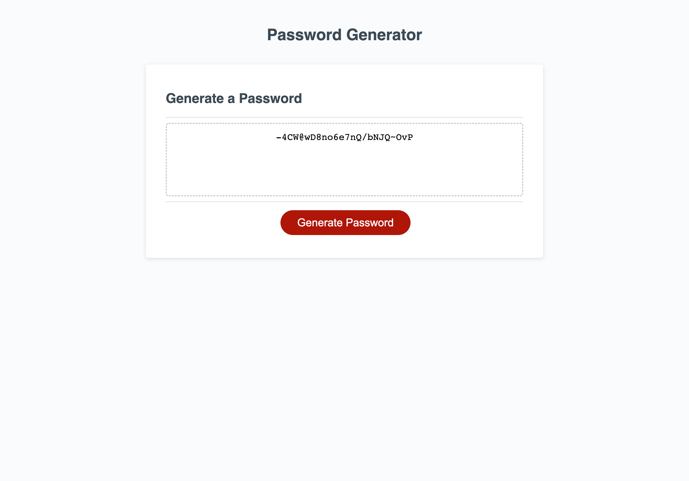

# Module-Challenge-3: Password Generator

## Description

This week's Challenge required a modification of starter code to generate random passwords based on criteria selected. 
I made adjustments in JavaScript code to generate random passwords once promted and validated some questions. 

## Installation
1. I used window.prompt and window.confirm so that I am presented with a series of prompts for password criteria.
2. Questions were set to confirm whether the critera is met (lowercase, uppercase, special characters, numerical values).
3. Password is generated using Math.random and including all the arrays to generate code in Javascript if criteria is met.
4. Code was altered so the generated password would be written to the webpage.

## Screenshot

The following image shows the web application's appearance and functionality:

## Usage

Webpage:

 [Github Page Address](https://github.com/delacruzjonathan/Module-3-Challenge)

